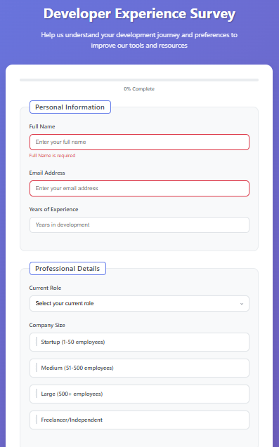

# 🚀 Shibam Banerjee - Developer Experience Survey Form


A comprehensive, responsive survey form designed to collect developer experience data and preferences. This form features modern UI design, advanced form validation, interactive elements, and accessibility features to ensure a smooth user experience across all devices.

## 📸 Screenshots

<div align="center">
  
  <p><em>Modern survey form with comprehensive developer experience questions and validation</em></p>
</div>

## ✨ Live Demo

🌐 **[View Live Demo](https://your-live-demo-link.com)** *(Update after deployment)*

## 🚀 Key Features

- **📋 Comprehensive Form**: Multi-section survey with various input types
- **✅ Form Validation**: Real-time validation with user-friendly error messages
- **📱 Fully Responsive**: Mobile-first design optimized for all devices
- **🎨 Modern UI**: Clean and professional form design
- **♿ Accessibility**: WCAG compliant with proper labels and ARIA attributes
- **🔍 Input Types**: Text, email, number, radio, checkbox, select, and textarea
- **📊 Progress Indicator**: Visual progress tracking through form sections
- **💾 Data Handling**: Structured data collection and processing
- **🎭 Smooth Animations**: CSS transitions and interactive feedback
- **⚡ Fast Performance**: Optimized code for quick loading

## 🎨 Design System

### Color Palette
- **Primary**: Professional blues and tech-inspired colors
- **Success**: Green for validation success states
- **Error**: Red for validation error states
- **Background**: Clean whites with subtle gradients
- **Text**: High contrast for optimal readability

### Typography
- **Headings**: Bold, clear section headers
- **Labels**: Readable form labels
- **Input Text**: Clean and legible input styling

## 📱 Form Sections

1. **👤 Personal Information** - Name, email, and basic details
2. **💻 Development Experience** - Programming languages and experience level
3. **🛠️ Tools & Technologies** - Preferred development tools and frameworks
4. **📚 Learning Preferences** - Educational resources and learning methods
5. **💼 Career Goals** - Professional aspirations and interests
6. **💭 Additional Feedback** - Open-ended comments and suggestions

## 🛠️ Tech Stack

- **⚡ Frontend**: HTML5, CSS3, JavaScript (ES6+)
- **🎨 Styling**: Custom CSS with Flexbox and Grid
- **✅ Validation**: JavaScript form validation with real-time feedback
- **📱 Responsive**: Mobile-first design approach
- **🔍 SEO**: Semantic HTML and proper meta tags
- **♿ Accessibility**: WCAG 2.1 AA compliant

## 🚀 Getting Started

### Prerequisites

- Web browser (Chrome, Firefox, Safari, Edge)
- Text editor (VS Code, Sublime Text, etc.)
- Basic knowledge of HTML, CSS, and JavaScript

### Installation

1. **Clone the repository**
   ```bash
   git clone https://github.com/Shibam-Code-Pro/survey-form.git
   cd survey-form
   ```

2. **Open the project**
   ```bash
   # Simply open index.html in your browser
   open index.html
   # or
   start index.html
   ```

3. **For development**
   - Use a local server like Live Server extension in VS Code
   - Or use Python's built-in server: `python -m http.server 8000`

## 📁 Project Structure

```
survey-form/
├── 📄 index.html              # Main HTML file with form structure
├── 🎨 styles.css              # CSS styles and responsive design
├── ⚡ script.js               # JavaScript validation and interactions
├── 📸 screenshot/             # Project screenshots
│   └── survey-form.png
├── 📖 README.md               # Project documentation
├── 📜 LICENSE                 # MIT License
└── 🚫 .gitignore              # Git ignore rules
```

## 🛠️ Technologies Used

<table>
<tr>
<td align="center"><br><b>HTML5</b></td>
<td align="center"><br><b>CSS3</b></td>
<td align="center"><br><b>JavaScript</b></td>
<td align="center"><br><b>Git</b></td>
<td align="center"><br><b>VS Code</b></td>
</tr>
</table>

## 🎯 Form Features

### ✅ Validation Rules

- **Required Fields**: Name, email, and experience level
- **Email Validation**: Proper email format checking
- **Number Validation**: Age and experience year constraints
- **Real-time Feedback**: Instant validation as user types
- **Error Messages**: Clear, helpful error descriptions

### 📊 Input Types Used

- **Text Input**: Name and open-ended responses
- **Email Input**: Email address with validation
- **Number Input**: Age and years of experience
- **Radio Buttons**: Single-choice questions
- **Checkboxes**: Multiple-choice selections
- **Select Dropdown**: Organized option lists
- **Textarea**: Long-form responses and feedback

## 🌐 Deployment

### 🚀 Quick Deploy Options

1. **GitHub Pages**
   - Push to GitHub repository
   - Enable GitHub Pages in repository settings
   - Access via `https://username.github.io/repository-name`

2. **Netlify**
   - Drag and drop project folder to Netlify
   - Built-in form handling capabilities
   - Automatic HTTPS and CDN

3. **Vercel**
   - Import GitHub repository
   - Deploy with zero configuration
   - Perfect for static forms

### 🔧 Pre-Deployment Checklist

- ✅ Test all form validations
- ✅ Verify responsive design on all devices
- ✅ Check accessibility with screen readers
- ✅ Test form submission handling
- ✅ Update live demo URL in README

## 📊 Performance Features

- **Efficient Validation**: Optimized JavaScript for real-time feedback
- **CSS Optimization**: Minimal and organized stylesheets
- **Semantic HTML**: Proper form structure for accessibility
- **SEO**: Form-focused meta tags and descriptions
- **Accessibility**: Full keyboard navigation support

## 🎯 Special Features

### 📋 Multi-Section Form
- Organized into logical sections
- Clear section headers and descriptions
- Progressive disclosure of information

### ✅ Advanced Validation
- Real-time validation feedback
- Custom error messages
- Success state indicators

### 📱 Mobile Optimization
- Touch-friendly input elements
- Optimized keyboard types for mobile
- Responsive layout for all screen sizes

## 🔧 Customization Guide

### Adding New Questions

1. **Add HTML Structure**: Create new form elements in `index.html`
2. **Style the Elements**: Add corresponding CSS in `styles.css`
3. **Add Validation**: Include validation logic in `script.js`
4. **Update Form Handling**: Modify submission logic as needed

### Modifying Validation Rules

1. Open `script.js`
2. Locate the validation functions
3. Modify or add new validation criteria
4. Update error messages accordingly

## 📝 License

This project is open source and available under the [MIT License](LICENSE).

## 🤝 Contributing

Contributions, issues, and feature requests are welcome! Feel free to check the [issues page](https://github.com/Shibam-Code-Pro/survey-form/issues).

## 📞 Contact

**Shibam Banerjee**
- Email: Connect-With-Shibam@outlook.com
- Phone: +91 62902-18960
- LinkedIn: [linkedin.com/in/shibam-webdev](https://linkedin.com/in/shibam-webdev)
- GitHub: [github.com/Shibam-Code-Pro](https://github.com/Shibam-Code-Pro)

## 🙏 Acknowledgments

- [HTML5](https://developer.mozilla.org/en-US/docs/Web/HTML) for semantic form structure
- [CSS3](https://developer.mozilla.org/en-US/docs/Web/CSS) for modern styling
- [JavaScript](https://developer.mozilla.org/en-US/docs/Web/JavaScript) for form validation
- [MDN Web Docs](https://developer.mozilla.org/) for web standards reference
- [WCAG Guidelines](https://www.w3.org/WAI/WCAG21/quickref/) for accessibility standards

---

⭐ **If you found this project helpful, please give it a star!** ⭐
